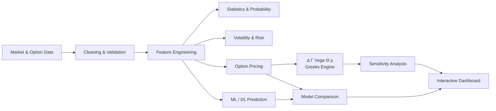
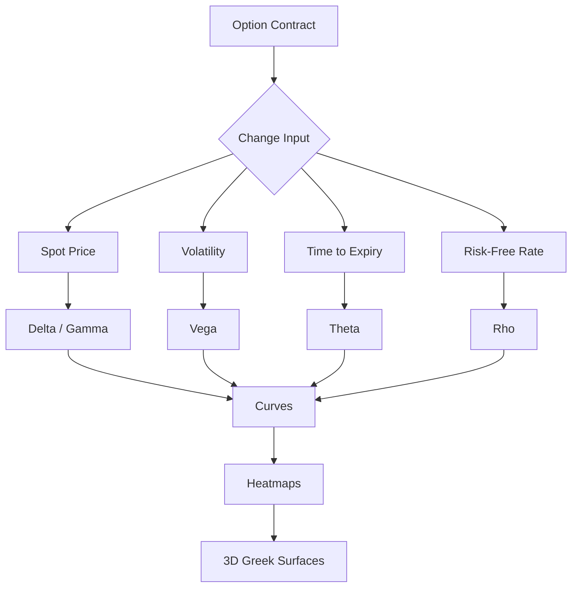
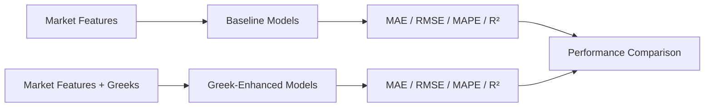
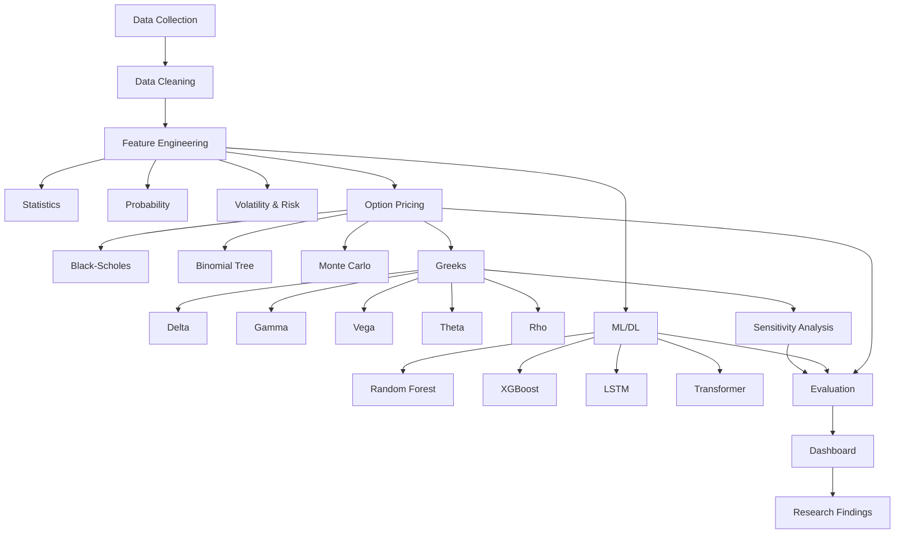

<div align="center">


# FINO — Stock & Option Market Analyzer

### *Rising from raw market data to intelligent, risk-aware predictions*

<p>

</p>

<b>Statistics • Probability • Option Pricing • Greeks • Machine Learning • Deep Learning</b>

</div>

---

## Why "FINO" & the Phoenix?

**FINO** stands for **F**inancial **IN**telligence & **O**ptions analysis — a platform built to take raw, chaotic market data and transform it into clear, actionable insight, the same way a phoenix rises renewed from fire and ash. The phoenix is FINO's symbol: volatile, ever-changing markets (the fire) refined through statistics, pricing models, Greeks, and machine learning into disciplined, data-driven understanding (the rebirth).

---

## Overview

**FINO — Stock & Option Market Analyzer** is an interactive quantitative-finance platform for analyzing stock and option markets through statistical analysis, probability, financial mathematics, risk analytics, option Greeks, machine learning, and deep learning.

The project primarily focuses on **NIFTY 50** and **NIFTY Options**, with **S&P 500** and related options as an international extension.

It brings multiple approaches into one unified system:



---

## Key Features

### Market & Statistical Analysis
- Historical stock/index analysis
- Returns and descriptive statistics
- Skewness and kurtosis
- Return distributions
- Probability and conditional-probability analysis

### Volatility & Risk
- Historical volatility
- Implied volatility when available
- Volatility-regime classification
- Risk-oriented market analysis

### Option Pricing

The project implements three classical pricing approaches:

| Model | Purpose |
|---|---|
| **Black-Scholes** | Analytical Call/Put pricing |
| **Binomial Tree** | Numerical Call/Put pricing |
| **Monte Carlo** | Simulation-based option pricing |

### Option Greeks

The project calculates the five standard Greeks:

| Greek | Symbol | Measures |
|---|---|---|
| Delta | Δ | Sensitivity to underlying price |
| Gamma | Γ | Change in Delta |
| Vega | ν | Sensitivity to volatility |
| Theta | Θ | Time decay |
| Rho | ρ | Sensitivity to interest rates |

```
                        OPTION RISK
                             |
        +--------------------+--------------------+
        |                    |                     |
    Underlying           Volatility               Time
        |                    |                     |
      DELTA                 VEGA                  THETA
        |
      GAMMA
                             |
                       Interest Rate
                             |
                            RHO
```

---

## Greek Sensitivity Analysis

Instead of only displaying Greek values, the system studies how they change when market variables change.



---

## Machine Learning & Deep Learning

The analyzer compares traditional mathematical pricing with data-driven prediction.

| Category | Models |
|---|---|
| **Machine Learning** | Random Forest, XGBoost |
| **Deep Learning** | LSTM, Transformer |

### Greek-Enhanced Experiment

A key research component is testing whether Greeks improve prediction performance.



**Baseline features:** Spot Price · Strike Price · Time to Expiry · Implied Volatility · Volume · Open Interest · Historical Volatility

**Greek-enhanced features:** Baseline Features + Delta, Gamma, Vega, Theta, Rho

---

## Research Questions

> Do Greek-derived features improve machine-learning and deep-learning option-price prediction?

Additional analysis includes:
- How does **Delta** change across ITM, ATM and OTM options?
- How does **Gamma** behave near the strike price?
- How does **Vega** change with time to expiry?
- How does **Theta** evolve as expiry approaches?
- How do **volatility regimes** affect option-price prediction?
- Which model performs best under different market conditions?

---

## Dashboard Concept

The final dashboard is designed around a unified analysis workflow:

```
+------------------------------------------------------------+
|            FINO - STOCK & OPTION MARKET ANALYZER           |
+------------------------------------------------------------+
| Market Overview | Statistics | Probability | Risk          |
+------------------------------------------------------------+
|                     OPTION CALCULATOR                      |
|   Spot | Strike | Expiry | IV | Rate | Call / Put          |
+------------------------------------------------------------+
|                       OPTION GREEKS                        |
|   Delta | Gamma | Vega | Theta | Rho                       |
+------------------------------------------------------------+
|               SENSITIVITY & SCENARIO ANALYSIS              |
|   Curves | Heatmaps | Greek Surfaces | Tables              |
+------------------------------------------------------------+
|                     MODEL PREDICTIONS                      |
| BS | Binomial | Monte Carlo | RF | XGB | LSTM | Transformer|
+------------------------------------------------------------+
|                     MODEL COMPARISON                       |
|   Actual vs Predicted | MAE | RMSE | MAPE | R^2            |
+------------------------------------------------------------+
```

> **Visual note:** This section can later be replaced with real screenshots from the Streamlit application.

---

## Complete Project Workflow



---

## Project Architecture

```
fino-stock-option-market-analyzer/
│
├── Fino.png
│ 
│
├── data/
│ ├── raw/
│ └── processed/
│
├── notebooks/
│ ├── data_analysis/
│ ├── option_pricing/
│ ├── greeks/
│ └── ml_dl/
│
├── src/
│ ├── data/
│ ├── statistics/
│ ├── probability/
│ ├── volatility/
│ ├── pricing/
│ ├── greeks/
│ ├── models/
│ ├── evaluation/
│ └── visualization/
│
├── dashboard/
│ └── app.py
│
├── tests/
│
├── requirements.txt
├── README.md
└── LICENSE
```

---

## Black-Scholes Greek Core

The Black-Scholes implementation provides the analytical foundation for the Greeks.

**Core variables**

| Symbol | Meaning |
|---|---|
| S | Spot Price |
| K | Strike Price |
| T | Time to Expiry |
| σ | Volatility |
| r | Risk-Free Rate |

**d₁ and d₂**

$$d_1 = \frac{\ln(S/K)+(r+\sigma^2/2)T}{\sigma\sqrt{T}}$$

$$d_2 = d_1 - \sigma\sqrt{T}$$

**Greeks derived from d₁ / d₂:**

| Greek | Sensitivity to |
|---|---|
| Delta | Underlying price |
| Gamma | Delta itself |
| Vega | Volatility |
| Theta | Time |
| Rho | Interest rate |

---

## Model Evaluation

The project evaluates predictions using:

| Metric | Purpose |
|---|---|
| **MAE** | Average absolute prediction error |
| **RMSE** | Penalizes larger prediction errors |
| **MAPE** | Relative percentage error |
| **R²** | Explained variance |

Models can be compared across:
- ITM / ATM / OTM options
- Low / Medium / High volatility regimes
- Different time-to-expiry ranges

---

## Expected Outputs

- Interactive market dashboard
- Statistical and probability analysis
- Volatility and risk analysis
- Option price estimates
- Delta, Gamma, Vega, Theta and Rho
- Greek sensitivity analysis (curves, heatmaps, 3D surfaces)
- ML/DL option-price predictions
- Actual vs predicted comparisons
- Model-performance comparison
- Greek-enhanced research experiments

---

## Technology Stack

| Category | Technology |
|---|---|
| **Programming** | Python |
| **Data Analysis** | Pandas, NumPy, SciPy |
| **ML** | Scikit-learn, XGBoost |
| **DL** | PyTorch / TensorFlow |
| **Backend** | FastAPI |
| **Dashboard** | Streamlit |
| **Database** | PostgreSQL / SQLite |
| **Visualization** | Plotly / Matplotlib |
| **Development** | Jupyter Notebook, VS Code |

---

## Installation

```bash
git clone https://github.com/Clestialcosmos/Fino-Stock-Option-Market-Analyzer.git
cd <folder_name>

python -m venv venv

# Windows
venv\Scripts\activate

# Linux / macOS
source venv/bin/activate

# Install dependencies
pip install -r requirements.txt

# Run the dashboard
streamlit run dashboard/app.py
```

---

## Project Roadmap

| Stage | Task | Status |
|---|---|---|
| 01 | Project Definition | Done |
| 02 | Data Collection | Pending |
| 03 | Data Cleaning & Database | Pending |
| 04 | Statistics & Probability | Pending |
| 05 | Volatility & Risk | Pending |
| 06 | Classical Option Pricing | Pending |
| 07 | Greeks Engine | Pending |
| 08 | Greek Sensitivity Analysis | Pending |
| 09 | Random Forest & XGBoost | Pending |
| 10 | LSTM & Transformer | Pending |
| 11 | Greek-Enhanced Experiments | Pending |
| 12 | Dashboard Integration | Pending |
| 13 | Research Analysis | Pending |
| 14 | Documentation & Demonstration | Pending |

---

## Disclaimer

This project is intended for **academic, educational and research purposes**. It does not provide guaranteed investment outcomes, investment advice, real-money trading, or automated order execution.

---

## Team

**Team Project — 3 Members**

| Member | Primary Responsibility |
|---|---|
| Member 1 | Data, Statistics, Classical Pricing & Greeks |
| Member 2 | Monte Carlo, ML/DL & Evaluation |
| Member 3 | Dashboard, Visualization & Integration |

---

<div align="center">

## Why This Project?

**From market data, to mathematical pricing, to Greeks, to sensitivity, to machine learning, to research.**

The goal is not simply to predict an option price, but to build an integrated environment where price, risk, sensitivity and predictive performance can be analyzed together — rising, like a phoenix, from raw data into clear insight.


### *Analyze • Price • Measure Risk • Predict • Research*

</div>


